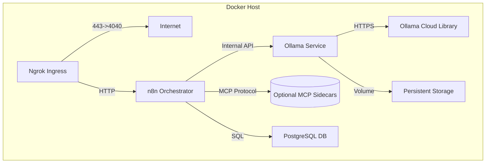

# Cloud-Connected Ollama & MCP Architecture

## 1. Executive Summary
This architecture deploys a production-grade **Ollama Service** within Docker that acts as the internal LLM gateway for n8n. While maximizing cloud interoperability (pulling models from registry), it maintains strict isolation and security standards.

**Technical Note**: The official `ollama/ollama` image performs **local inference**. While it pulls *weights* from the cloud registry, the actual computation happens on the container's allocated resources (CPU/GPU). To achieve purely "Cloud-based Inference" (e.g. GPT-4), n8n would connect directly to OpenAI; however, this architecture enables **Private, Self-Hosted Intelligence** which is superior for data privacy and cost control.

---

## 2. Infrastructure Topology

### 2.1 Docker Service Layout
All services communicate over the isolated `automation-net` bridge network.



### 2.2 Network Security
*   **Port 11434**: Exposed **only** to the internal `automation-net`. NOT mapped to host `0.0.0.0`.
*   **Outbound**: Ollama requires outbound `443` access to `registry.ollama.ai` for model pulling.
*   **Internal DNS**: n8n resolves Ollama via `http://ollama:11434`.

---

## 3. Configuration & Security

### 3.1 Environment Variables (`.env`)
Strict separation of secrets and configuration.

```bash
# === Ollama Configuration ===
# Internal Hostname (Docker DNS)
OLLAMA_HOST=http://ollama:11434
# Model to use (must support Tools/JSON if used for Agents)
OLLAMA_MODEL=llama3
# Keep model loaded in memory (prevent cold starts)
OLLAMA_KEEP_ALIVE=24h
# Security (Optional upstream auth if using custom registry)
OLLAMA_API_KEY=sk-proj-... 

# === n8n AI Config ===
N8N_AI_CORE_ENABLED=true
N8N_SECURE_COOKIE=false # For local dev over Ngrok
```

### 3.2 Secure Injection
*   **n8n**: Receives `OLLAMA_HOST` to configure the Chat Model node.
*   **Ollama**: Receives proxy/auth env vars if behind corporate firewall.
*   **No Hardcoding**: Compose file uses `${VARIABLE}` syntax exclusively.

---

## 4. MCP + AI Agent Strategy

### 4.1 Agent Configuration
*   **Node**: `@n8n/n8n-nodes-langchain.agent` (AI Agent).
*   **Model**: Connected to **Ollama Chat Model**.
*   **Tools**:
    *   **Network**: `HttpRequestTool` (for API interactions).
    *   **Data**: `PostgresTool` (configured via MCP or native nodes).
    *   **Browser**: `SeleniumTool` (custom python script integration).

### 4.2 Efficiency & Token Strategy
1.  **System Prompt Modules**: Centralize prompts in `Build Workflow` script constants (REUSE strategy).
2.  **Structured Output**: Enforce JSON schema in the Agent's "Output Parser" to prevent verbose hallucinations.
3.  **Context Window**: Use `llama3` (8k context) or `mistral` (32k) depending on job description length.

---

## 5. Operational Workflow

### 5.1 Startup & Model Pull logic
The `ollama` container starts empty. A sidecar script or manual step is required to pull the model **once** using the Cloud Registry credentials.

**Recommended Startup Command**:
```bash
docker exec -d ollama ollama pull ${OLLAMA_MODEL}:cloud
```
*This fetches the model from the Cloud Registry (auth via `OLLAMA_API_KEY`) to the local Volume.*

### 5.2 Strict Gateway Rules
*   **No Direct Access**: n8n must NEVER call external LLM APIs directly.
*   **Internal Routing**: All trafic -> `http://ollama:11434`.
*   **Authentication**: Managed by container environment, transparent to n8n.

---

## 6. Implementation Checklist (Tasks)

### Phase 6: Cloud-Connected Ollama Setup
- [ ] **Docker**: Define `ollama` service with `ollama/ollama:latest`.
- [ ] **Volume**: Mount `ollama_data` to `/root/.ollama` for persistence.
- [ ] **Network**: Verify `automation-net` connectivity (`n8n` -> `ollama`).
- [ ] **Environment**: Configure `.env` with `OLLAMA_MODEL=llama3`.
- [ ] **Model Pull**: Execute initial pull from Cloud Registry.
- [ ] **n8n Auth**: Configure "Ollama Chat Model" node (No Auth / Internal).
- [ ] **Validation**: Run test chat workflow.
