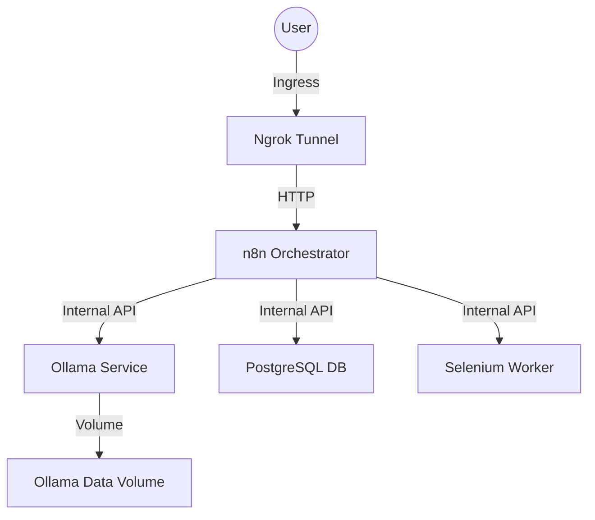

# n8n AI Agent + Ollama + MCP Architecture

## 1. Infrastructure Architecture

### 1.1 Docker Topology
All services run on the shared `automation-net` bridge network for secure internal communication.



### 1.2 Service Definitions

#### **Ollama Service**
- **Image**: `ollama/ollama:latest`
- **Hostname**: `ollama`
- **Port**: `11434` (Internal & Host exposure for pulling)
- **Volume**: `ollama_data:/root/.ollama` (Persistent model storage)
- **Environment**:
  - `OLLAMA_KEEP_ALIVE=24h` (Prevent model unloading)
  - `OLLAMA_HOST=0.0.0.0`
- **Health Check**: `curl -f http://localhost:11434/api/version || exit 1`

#### **n8n Service (Updates)**
- **Environment**:
  - `OLLAMA_HOST=ollama:11434`
  - `N8N_AI_CORE_ENABLED=true`

### 1.3 Networking
- **Internal**: n8n connects to Ollama via `http://ollama:11434`.
- **External**: Ngrok exposes n8n only. Ollama is NOT exposed publicly.

---

## 2. n8n AI Agent & MCP Design

### 2.1 Core Reasoning Engine
The massive valid linear workflows will be replaced/augmented by a **centralized AI Agent Node**.

*   **Node**: `@n8n/n8n-nodes-langchain.agent`
*   **Model**: Ollama Chat Model (`llama3:latest` or `mistral:latest`) using `http://ollama:11434`.
*   **Memory**: Window Buffer Memory (Postgres-backed if needed, or simple In-Memory for short tasks).

### 2.2 MCP Integration Strategy
The AI Agent will use **Model Context Protocol (MCP)** to access tools dynamically.

*   **Tool Source**: Native n8n Tools converted to MCP-compatible tools OR external MCP servers.
*   **Tool Registry**:
    *   `browser_tool`: Scrape Job Description (via Selenium).
    *   `database_tool`: Query/Upsert Candidates (via Postgres).
    *   `gmail_tool`: Read/Send Emails (via Gmail Node).
    *   `calendar_tool`: Check Availability/Schedule (via Google Calendar).

### 2.3 LLM Reuse & Efficiency
*   **Shared Model Node**: A single "Ollama Chat Model" node configured with base URL and credentials.
*   **Prompt Templates**: System prompts stored in `.env` or distinct variables to avoid hardcoding.
*   **Token Optimization**: Use "Structured Output Parsers" to force JSON schema, reducing "chatty" responses.

---

## 3. Operational Procedures

### 3.1 Model Management (Pull Strategy)
Models are not baked into the image. They are pulled at runtime or initialization.

**Startup Script (`init-ollama.sh`)**:
```bash
#!/bin/bash
# Check if model exists, if not, pull it
ollama list | grep $OLLAMA_MODEL || ollama pull $OLLAMA_MODEL
```

### 3.2 Environment Variables (`.env`)
Securely injected into containers.

```bash
# Ollama
OLLAMA_MODEL=llama3
OLLAMA_api_URL=http://ollama:11434
OLLAMA_KEEP_ALIVE=24h

# n8n AI
N8N_AI_OPENAI_API_KEY=not-needed-for-local
```

### 3.3 Health Checks
- **Ollama**: Verify API responsive.
- **n8n**: Verify connection to Ollama via "Test Connection" in credential setup.

---

## 4. Production Readiness Checklist
- [ ] Docker Compose updated with Ollama.
- [ ] Persistent volumes configured.
- [ ] Internal DNS (`n8n` -> `ollama`) verification.
- [ ] Model pull automated or documented.
- [ ] `.env` updated with Ollama configs.
